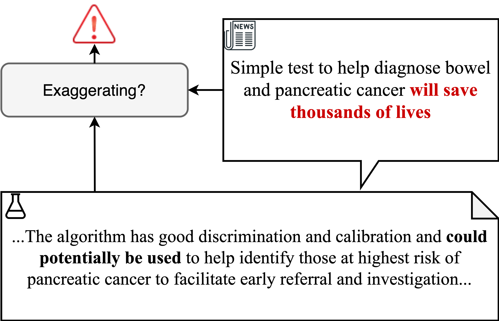

# Semi-Supervised Exaggeration Detection of Health Science Press Releases

Dustin Wright and Isabelle Augenstein

In EMNLP 2021

https://arxiv.org/pdf/2108.13493.pdf%20

<p align="center">
  
</p>

Public trust in science depends on honest and factual communication of scientific papers. However, recent studies have demonstrated a tendency of news media to misrepresent scientific papers by exaggerating their findings. Given this, we present a formalization of and study into the problem of exaggeration detection in science communication. While there are an abundance of scientific papers and popular media articles written about them, very rarely do the articles include a direct link to the original paper, making data collection challenging. We address this by curating a set of labeled press release/abstract pairs from existing expert annotated studies on exaggeration in press releases of scientific papers suitable for benchmarking the performance of machine learning models on the task. Using limited data from this and previous studies on exaggeration detection in science, we introduce MT-PET, a multi-task version of Pattern Exploiting Training (PET), which leverages knowledge from complementary cloze-style QA tasks to improve few-shot learning. We demonstrate that MT-PET outperforms PET and supervised learning both when data is limited, as well as when there is an abundance of data for the main task.

## Data

The training and test data derived from the studies from [Sumner et al. 2014](https://www.bmj.com/content/349/bmj.g7015) and [Bratton et al. 2019](https://pubmed.ncbi.nlm.nih.gov/31728413/#:~:text=Results%3A%20We%20found%20that%20the,inference%20from%20non%2Dhuman%20studies.) can be found in the `data` directory. Files are formatted as json lines files, with each row containing the following fields:

```
original_file_id: The ID of the original spreadsheet in the Sumner/Bratton data where the annotations are derived from
press_release_conclusion: The conclusion sentence from the press release
press_release_strength: The strength label for the press release
abstract_conclusion: The conclusion sentence from the abstract
abstract_strength: The strength label for the abstract
exaggeration_label: The final exaggeration label
```

The exaggeration label is one of `same`, `exaggerates`, or `downplays`. The strength label is one of the following:

```
0: Statement of no relationship
1: Statement of correlation
2: Conditional statement of causation
3: Statement of causation
```

We used the data from `insciout_test.jsonl` as test data in all of the experiments in the paper. The claim strength data from [Yu et al. 2019](https://aclanthology.org/D19-1473/) and [Yu et al. 2020](https://aclanthology.org/2020.coling-main.427/) can be found [here](https://github.com/junwang4/correlation-to-causation-exaggeration/tree/master/data). You can download all of the data by running the following:

```bash
$ cd data
$ bash download_strength_data.sh
```

Raw unlabeled sentences from abstracts and press releases and training data for conclusion detection can be found in `data/conclusion_detection`.

## MT-PET

The code to run multi-task PET is included as a submodule pointing to [our PET fork](https://github.com/dwright37/mt-pet). Either clone that repository or pull the submodule by running `git submodule update --init --recursive`

## Environment setup

To setup an environment for running our experiments, first install [conda](https://www.anaconda.com/products/individual). Then, run the following:

```bash
$ conda env create -f environment.yml_test.yml
$ conda activate scientific-exaggeration-detection
```

**NOTE**: We use wandb for logging. If you do not have wandb and only wish to use it for logging, run:

```bash
$ wandb offline
```

## Running our experiments

The first step is to run conclusion detection using PET. To do this, run the following commands:

```bash
$ cd mt-pet
$ python cli.py \
    --method pet \
    --pattern_ids 0 1 2 3 4 5 \
    --data_dir ../data/conclusion_detection/ \
    --model_type roberta \
    --model_name roberta-base\
    --task_name conclusion-detection-labeled \
    --output_dir conclusion_detection \
    --do_train \
    --do_eval \
    --seed 1000 \
    --overwrite_output_dir \
    --pet_num_train_epochs 10 \
    --pet_per_gpu_train_batch_size 4 \
    --no_distillation \
    --learning_rate 0.000012 \
    --warmup_steps 50 \
    --weight_decay 0.01 \
    --balance_class_weight
```

Next, create unlabeled conclusion sentences by running the following, selecting the directory corresponding to the main task:

```bash
$ cd ..
$ python create_pet_unlabelled_sentences_file.py \
    data/conclusion_detection/unlabelled_pet.jsonl \
    data/conclusion_detection/unlabelled_ids.txt \
    mt-pet/conclusion_detection/unlabeled_logits.txt \
    data/{pet_nli|pet_cls}/unlabelled_pet.jsonl
```

You can then run multi-task PET as follows (this example is for using CLS as the main task):

```bash
$ cd mt-pet
$ python cli.py \
    --method pet \
    --pattern_ids 1 3 \
    --data_dir ../data/pet_cls \
    --aux_data_dir ../data/pet_nli \
    --model_type roberta \
    --model_name roberta-base \
    --aux_task_name exaggeration-detection-nli-from-petal \
    --task_name exaggeration-detection-multi-task \
    --output_dir pet_cls \
    --do_train \
    --do_multi_task \
    --seed 1000 \
    --overwrite_output_dir \
    --no_distillation \
    --pet_num_train_epochs 10 \
    --pet_per_gpu_train_batch_size 4  \
    --learning_rate 0.00003 \
    --warmup_steps 50 \
    --weight_decay 0.0001  \
    --balance_class_weight \
    --aux_verbalizer_file ../data/pet_nli/verbalizers.json
```

Format the data for knowledge distillation as follows:

```bash
$ cd ..
$ python create_pet_labelled_file.py \
    data/pet_cls/unlabelled_pet.jsonl \
    mt-pet/pet_cls/unlabeled_logits.txt \
    data/pet_cls/pet_soft_labeled.csv
```

Finally, train the final model and evaluate it as follows:

```bash
$ python run_cls.py \
    --yu_et_al_data data/combined_strength_data.csv \
    --pet_data data/pet_cls/pet_soft_labeled.csv \
    --test_data_loc data/insciout_test.jsonl \
    --model_name roberta-base \
    --model_dir models/cls \
    --run_name pet-cls \
    --tag cls \
    --n_gpu 1 \
    --batch_size 4 \
    --learning_rate 0.00001 \
    --n_epochs 3 \
    --seed 1000 \
    --warmup_steps 200 \
    --balance_class_weight \
    --temperature 2.0
```

To run with NLI as the main task, change the main and auxiliary tasks when running MT-PET and use the `run_nli.py` script for training.

## Citation

```
@inproceedings{wright2021exaggeration,
    title={{Semi-Supervised Exaggeration Detection of Health Science Press Releases}},
    author={Dustin Wright and Isabelle Augenstein},
    booktitle = {Proceedings of EMNLP},
    publisher = {Association for Computational Linguistics},
    year = 2021
}
```
